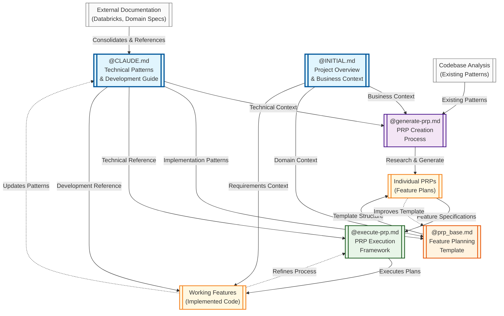
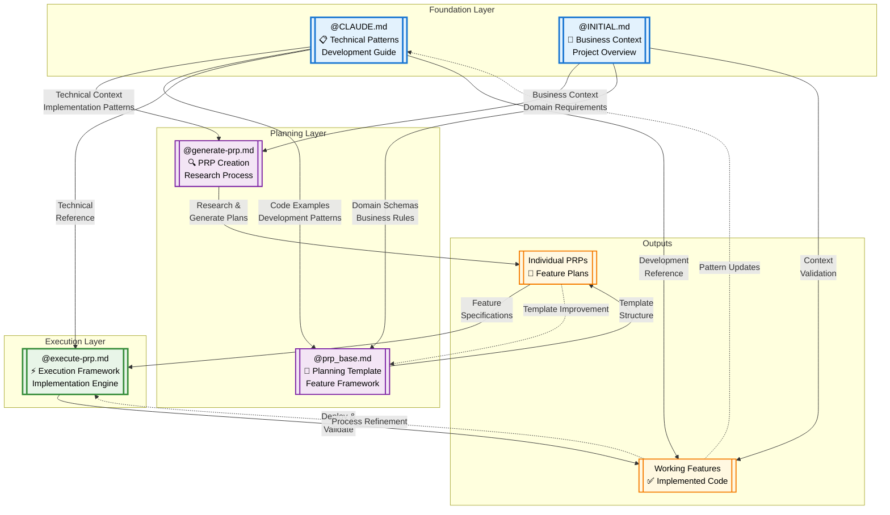

# About 
This repository provides a modern data engineering project template for Databricks, built on context engineering principles. It features:

- Medallion architecture implementation (Bronze → Silver → Gold layers)
- Declarative data pipelines using Delta Live Tables (DLT)
- Infrastructure-as-code deployment with Databricks Asset Bundles
- Best practices for data quality, governance and CI/CD
- Comprehensive documentation and example implementations

The template enables rapid development of production-ready Databricks solutions while enforcing architectural standards and deployment best practices.

# File Responsibility Comparison Table

| Attribute | @CLAUDE.md | @INITIAL.md | @prp_base.md | @execute-prp.md | @generate-prp.md |
|-----------|------------|-------------|--------------|-----------------|------------------|
| **Main Responsibility** | Technical development guide & patterns | Project overview & business context | Feature planning template | PRP execution framework | PRP creation process |
| **Primary Purpose** | "How to implement" | "What to build" | "Plan a feature" | "Execute a plan" | "Create a plan" |
| **Target Audience** | Developers & AI agents | Product/Business stakeholders | Feature planners | Implementation teams | Planning teams |

## Content Guidelines

### **What SHOULD be included:**

| File | Should Include |
|------|----------------|
| **@CLAUDE.md** | • Asset Bundle patterns • DLT pipeline examples • Configuration templates • Development workflows • External documentation links • Critical code patterns • Environment setup |
| **@INITIAL.md** | • Business domain context • Entity schemas • Project architecture • Success criteria • Compliance requirements • Data governance • Domain-specific examples |
| **@prp_base.md** | • Feature planning template • Implementation blueprints • Validation loops • Context requirements • Test cases • Anti-patterns • Domain-specific code examples |
| **@execute-prp.md** | • Execution commands • Validation gates • Error handling • Rollback procedures • Monitoring scripts • Success criteria • Quality gates |
| **@generate-prp.md** | • Research strategies • Context gathering • PRP creation workflow • Quality scoring • Template population • Validation criteria |

### **What should NOT be included:**

| File | Should NOT Include |
|------|-------------------|
| **@CLAUDE.md** | ❌ Business requirements ❌ Specific feature plans ❌ Execution commands ❌ Domain schemas ❌ Project roadmaps |
| **@INITIAL.md** | ❌ Implementation code ❌ Technical patterns ❌ Execution steps ❌ Development workflows ❌ CLI commands |
| **@prp_base.md** | ❌ General development patterns ❌ Project setup instructions ❌ Execution frameworks ❌ Non-feature content |
| **@execute-prp.md** | ❌ Planning templates ❌ Business requirements ❌ General development guides ❌ Feature specifications |
| **@generate-prp.md** | ❌ Actual implementation code ❌ Execution commands ❌ Business requirements ❌ Technical patterns |

## Key Attributes

### **Usage Patterns:**

| File | When to Use | Update Frequency |
|------|-------------|------------------|
| **@CLAUDE.md** | Before any development work | Rarely (foundational patterns) |
| **@INITIAL.md** | Project onboarding & context setting | Occasionally (major project changes) |
| **@prp_base.md** | Planning new features | Never (it's a template) |
| **@execute-prp.md** | Implementing planned features | Rarely (process improvements) |
| **@generate-prp.md** | Creating feature plans | Rarely (process improvements) |

### **Information Density:**

| File | Content Type | Detail Level | Context Richness |
|------|-------------|--------------|------------------|
| **@CLAUDE.md** | Technical patterns | High | Implementation-focused |
| **@INITIAL.md** | Business context | Medium | Domain-focused |
| **@prp_base.md** | Planning framework | Very High | Feature-specific |
| **@execute-prp.md** | Process framework | High | Execution-focused |
| **@generate-prp.md** | Meta-process | Medium | Process-focused |

### **Dependencies & Relationships:**

| File | Depends On | Feeds Into | Relationship |
|------|------------|------------|--------------|
| **@CLAUDE.md** | External docs, best practices | All implementation work | Foundation |
| **@INITIAL.md** | Business requirements | Feature planning | Context provider |
| **@prp_base.md** | @CLAUDE.md + @INITIAL.md | Feature implementation | Planning bridge |
| **@execute-prp.md** | Completed PRPs | Working features | Execution engine |
| **@generate-prp.md** | @CLAUDE.md + codebase analysis | New PRPs | Planning catalyst |

### **Maintenance Characteristics:**

| File | Maintenance Burden | Version Control Priority | Stability |
|------|-------------------|-------------------------|-----------|
| **@CLAUDE.md** | Low (stable patterns) | High (affects all dev) | Very Stable |
| **@INITIAL.md** | Medium (business evolution) | High (project foundation) | Stable |
| **@prp_base.md** | None (template) | Medium (process improvement) | Very Stable |
| **@execute-prp.md** | Low (process refinement) | Medium (execution quality) | Stable |
| **@generate-prp.md** | Low (process refinement) | Low (meta-process) | Stable |

## **Context Engineering Perspective:**

### **For AI Agent Usage:**

| File | AI Agent Value | Context Engineering Role |
|------|----------------|------------------------|
| **@CLAUDE.md** | ⭐⭐⭐⭐⭐ | Implementation patterns & technical context |
| **@INITIAL.md** | ⭐⭐⭐⭐ | Business domain & requirement context |
| **@prp_base.md** | ⭐⭐⭐⭐⭐ | Complete feature context & planning framework |
| **@execute-prp.md** | ⭐⭐⭐ | Execution validation & quality assurance |
| **@generate-prp.md** | ⭐⭐ | Meta-planning & context gathering strategy |

### **Optimal Usage Strategy:**
1. **Start with** `@CLAUDE.md` + `@INITIAL.md` for foundational context
2. **Use** `@generate-prp.md` to research and plan new features  
3. **Create** feature PRPs using `@prp_base.md` template
4. **Execute** PRPs using `@execute-prp.md` framework
5. **Reference** `@CLAUDE.md` during implementation for technical patterns

This creates a **comprehensive context engineering ecosystem** where each file has a distinct, non-overlapping responsibility while maintaining clear relationships and dependencies.

I've created three complementary Mermaid diagrams showing different perspectives on the file dependencies:

## **Diagram 1: Complete Ecosystem**
Shows the full context including external documentation and codebase analysis feeding into the system, with clear foundation → planning → execution → output flow.

## **Diagram 2: Layered Architecture** 
Organizes the 5 files into logical layers:
- **Foundation Layer**: @CLAUDE.md & @INITIAL.md (stable knowledge bases)
- **Planning Layer**: @generate-prp.md & @prp_base.md (feature planning)
- **Execution Layer**: @execute-prp.md (implementation)

## **Diagram 3: Information Flow**
Focuses on the types of dependencies:
- **Information/Context** (dotted lines): Knowledge transfer
- **Process/Creates** (solid lines): Active creation/execution
- **Feedback/Updates** (curved dotted): Improvement loops

## **Key Dependency Insights:**

### **Primary Dependencies:**
- `@CLAUDE.md` + `@INITIAL.md` → Foundation for all other files
- `@generate-prp.md` → Creates PRPs using foundation knowledge
- `@prp_base.md` → Template structure for feature planning
- `@execute-prp.md` → Executes completed PRPs

### **Critical Relationships:**
1. **@CLAUDE.md is the technical spine** - referenced by planning, execution, and implementation
2. **@INITIAL.md provides business context** - validates requirements and domain alignment  
3. **@prp_base.md acts as the bridge** - connects abstract planning to concrete implementation
4. **Feedback loops exist** - implemented features improve patterns and processes

### **Dependency Characteristics:**
- **Foundational files** (@CLAUDE.md, @INITIAL.md) have **outgoing dependencies only**
- **Process files** (@generate-prp.md, @execute-prp.md) have **both incoming and outgoing**
- **Template file** (@prp_base.md) is **primarily consumed, rarely updated**
- **Strong separation of concerns** - each file has distinct responsibilities with minimal overlap

This dependency structure ensures **modular, maintainable context engineering** where changes propagate predictably through the system.

