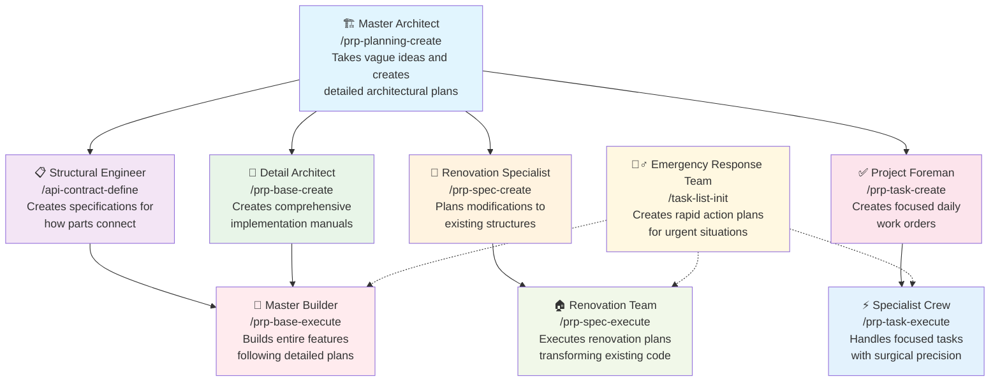

```mermaid
graph TD
    A[🏗️ Master Architect<br/>/prp-planning-create<br/>Takes vague ideas and creates<br/>detailed architectural plans] --> B[📋 Structural Engineer<br/>/api-contract-define<br/>Creates specifications for<br/>how parts connect]
    
    A --> C[📐 Detail Architect<br/>/prp-base-create<br/>Creates comprehensive<br/>implementation manuals]
    
    A --> D[🔧 Renovation Specialist<br/>/prp-spec-create<br/>Plans modifications to<br/>existing structures]
    
    A --> E[✅ Project Foreman<br/>/prp-task-create<br/>Creates focused daily<br/>work orders]
    
    B --> F[🔨 Master Builder<br/>/prp-base-execute<br/>Builds entire features<br/>following detailed plans]
    
    C --> F
    
    D --> G[🏠 Renovation Team<br/>/prp-spec-execute<br/>Executes renovation plans<br/>transforming existing code]
    
    E --> H[⚡ Specialist Crew<br/>/prp-task-execute<br/>Handles focused tasks<br/>with surgical precision]
    
    I[🏃‍♂️ Emergency Response Team<br/>/task-list-init<br/>Creates rapid action plans<br/>for urgent situations] -.-> F
    I -.-> G  
    I -.-> H
    
    style A fill:#e1f5fe
    style B fill:#f3e5f5
    style C fill:#e8f5e8
    style D fill:#fff3e0
    style E fill:#fce4ec
    style F fill:#ffebee
    style G fill:#f1f8e9
    style H fill:#e3f2fd
    style I fill:#fff8e1
```
