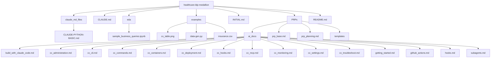

```mermaid
graph TD
    A[healthcare-ldp-medallion] --> B[claude_md_files]
    B --> B1[CLAUDE-PYTHON-BASIC.md]
    
    A --> C[CLAUDE.md]
    
    A --> D[eda]
    D --> D1[sample_business_queries.ipynb]
    
    A --> E[examples]
    E --> E1[cx_table.png]
    E --> E2[data-gen.py]
    E --> E3[insurance.csv]
    
    A --> F[INITIAL.md]
    
    A --> G[PRPs]
    G --> G1[ai_docs]
    G1 --> G1a[build_with_claude_code.md]
    G1 --> G1b[cc_administration.md]
    G1 --> G1c[cc_cli.md]
    G1 --> G1d[cc_commands.md]
    G1 --> G1e[cc_containers.md]
    G1 --> G1f[cc_deployment.md]
    G1 --> G1g[cc_hooks.md]
    G1 --> G1h[cc_mcp.md]
    G1 --> G1i[cc_monitoring.md]
    G1 --> G1j[cc_settings.md]
    G1 --> G1k[cc_troubleshoot.md]
    G1 --> G1l[getting_started.md]
    G1 --> G1m[github_actions.md]
    G1 --> G1n[hooks.md]
    G1 --> G1o[subagents.md]
    
    G --> G2[prp_base.md]
    G --> G3[prp_planning.md]
    G --> G4[templates]
    
    A --> H[README.md]
```