# Healthcare Medallion Pipeline - Table Relationships & Data Flow

## Architecture Overview

```mermaid
graph TB
    %% Raw Data Sources
    subgraph "Raw Data Sources"
        CSV1[patients*.csv]
        CSV2[medical_events*.csv] 
        CSV3[claims*.csv]
    end

    %% Bronze Layer
    subgraph "Bronze Layer (Ingestion)"
        B1[bronze_patients]
        B2[bronze_medical_events]
        B3[bronze_claims]
        
        %% Quality metrics tables
        BQ1[bronze_patients_quality_metrics]
        BQ2[bronze_medical_events_quality_metrics]
        BQ3[bronze_claims_quality_metrics]
        
        %% Clinical patterns table
        BP1[bronze_medical_events_clinical_patterns]
        BA1[bronze_claims_anomaly_detection]
    end

    %% Silver Layer
    subgraph "Silver Layer (Transformation & Validation)"
        S1[silver_patients]
        S2[silver_medical_events]
        S3[silver_claims]
        
        %% Staging views
        SS1[silver_patients_staging]
        SS2[silver_medical_events_staging]
        SS3[silver_claims_staging]
        
        %% Quarantine tables
        SQ1[silver_patients_quarantine]
        SQ2[silver_medical_events_orphaned]
        SQ3[silver_claims_orphaned]
        
        %% Quality summaries
        SQS1[silver_patients_quality_summary]
        SQS2[silver_medical_events_quality_summary]
        SQS3[silver_claims_quality_summary]
    end

    %% Gold Layer
    subgraph "Gold Layer (Analytics & Dimensional Model)"
        %% Dimension Table
        G1[dim_patients]
        GS1[dim_patients_summary]
        
        %% Fact Tables
        G2[fact_medical_events]
        G3[fact_claims]
        
        %% Analytics Tables
        GA1[fact_medical_events_care_pathways]
        GA2[fact_claims_monthly_summary]
    end

    %% Data Flow - Bronze Ingestion
    CSV1 -->|Auto Loader| B1
    CSV2 -->|Auto Loader| B2
    CSV3 -->|Auto Loader| B3
    
    %% Bronze to Quality Metrics
    B1 --> BQ1
    B2 --> BQ2
    B2 --> BP1
    B3 --> BQ3
    B3 --> BA1

    %% Bronze to Silver Flow
    B1 --> SS1
    B2 --> SS2
    B3 --> SS3
    
    SS1 --> S1
    SS2 --> S2
    SS3 --> S3
    
    %% Silver Quarantine Flow
    SS1 --> SQ1
    B2 --> SQ2
    B3 --> SQ3
    
    %% Silver Quality Summaries
    S1 --> SQS1
    S2 --> SQS2
    S3 --> SQS3

    %% Silver to Gold Flow
    S1 --> G1
    G1 --> GS1
    
    %% Fact table relationships with FK validation
    S2 --> G2
    S3 --> G3
    G1 -.->|FK Relationship| G2
    G1 -.->|FK Relationship| G3
    
    %% Gold Analytics
    G2 --> GA1
    G3 --> GA2

    %% Styling
    classDef bronze fill:#8B4513,stroke:#654321,stroke-width:2px,color:#fff
    classDef silver fill:#C0C0C0,stroke:#808080,stroke-width:2px,color:#000
    classDef gold fill:#FFD700,stroke:#B8860B,stroke-width:2px,color:#000
    classDef source fill:#90EE90,stroke:#006400,stroke-width:2px,color:#000

    class CSV1,CSV2,CSV3 source
    class B1,B2,B3,BQ1,BQ2,BQ3,BP1,BA1 bronze
    class S1,S2,S3,SS1,SS2,SS3,SQ1,SQ2,SQ3,SQS1,SQS2,SQS3 silver
    class G1,G2,G3,GS1,GA1,GA2 gold
```



## Table Relationships and Key Patterns

### 1. **Bronze Layer (Raw Ingestion)**
- **Purpose**: Raw data ingestion with Auto Loader and basic validation
- **Key Tables**:
  - `bronze_patients` - Patient demographics with PII/PHI
  - `bronze_medical_events` - Clinical events and medical history
  - `bronze_claims` - Insurance claims and financial data
- **Data Quality**: Basic validation, comprehensive audit trails
- **HIPAA Compliance**: Change data feed enabled, PII fields marked

### 2. **Silver Layer (Cleansed & Validated)**
- **Purpose**: Data transformation, standardization, and referential integrity
- **Key Relationships**:
  - **Referential Integrity**: `silver_medical_events` and `silver_claims` both reference `silver_patients`
  - **FK Validation**: Orphaned records quarantined if patient references don't exist
- **HIPAA De-identification**: 
  - SSN hashing, age de-identification (89+ → 90)
  - ZIP code anonymization for elderly patients
- **Data Quality**: Comprehensive scoring, clinical validation, temporal consistency

### 3. **Gold Layer (Analytics & Dimensional Model)**
- **Purpose**: Business intelligence, analytics, and reporting
- **Dimensional Model**:
  - **Dimension**: `dim_patients` (SCD Type 2 with surrogate keys)
  - **Facts**: `fact_medical_events` and `fact_claims`
- **Analytics Features**:
  - Care pathway analysis
  - Population health metrics
  - Financial analytics and trends
  - Clinical outcome tracking

## Key Data Flow Patterns

### Data Quality & Validation Pipeline
```
Bronze (Raw) → Staging Views → Validation → Silver (Clean) → Quarantine (Failed)
                                ↓
                         Quality Metrics → Gold Analytics
```

### Referential Integrity Pattern
```
silver_patients (Parent)
    ↓ FK Validation
silver_medical_events ← Orphaned Events (Quarantine)
silver_claims ← Orphaned Claims (Quarantine)
    ↓ Dimensional Modeling
dim_patients ← FK → fact_medical_events
             ← FK → fact_claims
```

### HIPAA Compliance Flow
```
Bronze (Raw PII) → Silver (De-identified) → Gold (Analytics-ready)
     ↓                    ↓                      ↓
Audit Trail         HIPAA Compliant      Business Intelligence
Change Data Feed    Anonymized Data      Reporting & Analytics
```

## Table Details

### Bronze Layer Tables
| Table | Purpose | Key Features |
|-------|---------|--------------|
| `bronze_patients` | Patient demographics ingestion | Auto Loader, PII protection, basic validation |
| `bronze_medical_events` | Medical events ingestion | Clinical validation, foreign key checks |
| `bronze_claims` | Insurance claims ingestion | Financial validation, referential integrity |
| `*_quality_metrics` | Data quality monitoring | Ingestion rates, validation metrics |
| `*_clinical_patterns` | Clinical analysis | Emergency events, care intensity |
| `*_anomaly_detection` | Fraud detection | High-value claims, unusual patterns |

### Silver Layer Tables
| Table | Purpose | Key Features |
|-------|---------|--------------|
| `silver_patients` | HIPAA-compliant patient data | De-identification, standardization, quality scoring |
| `silver_medical_events` | Validated clinical events | Referential integrity, clinical validation, temporal consistency |
| `silver_claims` | Validated insurance claims | Financial validation, clinical standardization, processing metrics |
| `*_staging` | Transformation staging | FK validation, malformed record filtering |
| `*_quarantine/*_orphaned` | Failed validation records | Audit trail preservation, review queues |
| `*_quality_summary` | Data quality reporting | Compliance metrics, validation summaries |

### Gold Layer Tables
| Table | Purpose | Key Features |
|-------|---------|--------------|
| `dim_patients` | Patient dimension (SCD Type 2) | Surrogate keys, historical tracking, risk scoring |
| `fact_medical_events` | Clinical events fact table | Care coordination, clinical outcomes, population health |
| `fact_claims` | Claims analytics fact table | Financial metrics, processing analytics, complexity scoring |
| `dim_patients_summary` | Patient dimension summary | Business intelligence metrics |
| `fact_*_care_pathways` | Care pathway analytics | Population health management |
| `fact_*_monthly_summary` | Executive dashboards | Trending analysis, KPIs |

## Data Quality & Compliance Features

### HIPAA Compliance
- **De-identification**: Age 89+ becomes 90, ZIP codes anonymized
- **PII Protection**: SSN hashing with salt, raw PII dropped in silver
- **Audit Trails**: Change data feed enabled throughout
- **Access Control**: PII fields marked in table properties

### Data Quality Scoring
- **Completeness Score**: Required field presence
- **Validity Score**: Format and range validation  
- **Consistency Score**: Cross-field and temporal validation
- **Clinical Quality**: Medical code validation, vital signs normality

### Referential Integrity
- **Foreign Key Validation**: All events/claims must reference valid patients
- **Orphan Management**: Failed FK checks quarantined with audit trail
- **Dimensional Relationships**: Surrogate keys for analytics performance

This architecture implements a robust, HIPAA-compliant healthcare data lakehouse with comprehensive data quality, referential integrity, and analytics capabilities.
