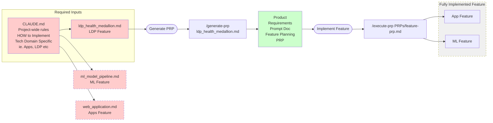

# PRP Generate and Execute Workflow Diagram

## Workflow Description

This diagram illustrates the planning and implementation workflow for features in the Databricks Context Engineering project:

1. **Pre-existing Planning & Context Inputs** (pink boxes):
   - CLAUDE.md provides project-wide implementation rules
   - Domain-specific documentation guides feature development

2. **Feature Planning Process**:
   - Generate Product Requirements Prompt (PRP) from base documentation
   - Create detailed implementation plans with validation steps
   - Store PRPs for execution

3. **Implementation Phase (Single Pass, Fully Architected Feature)**:
   - Execute features based on generated PRPs

4. **Additional Features**:
   - Can be added as separate base files with their own CLAUDE.md guides
   - Follow the same generate-prp → implement cycle
